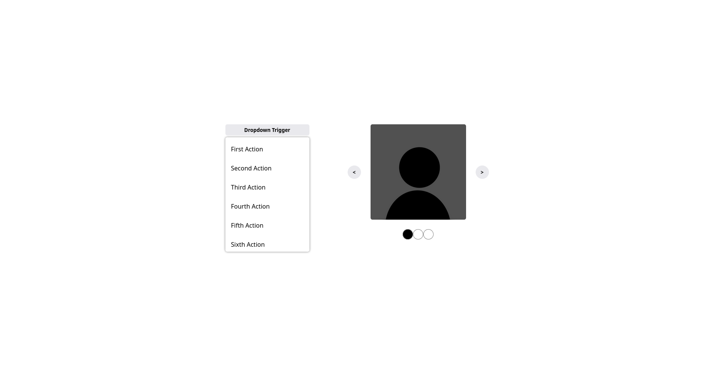

# Odin Dynamic User

## Table of contents

- [Overview](#overview)
  - [The challenge](#the-challenge)
  - [Screenshot](#screenshot)
  - [Links](#links)
- [My process](#my-process)
  - [Built with](#built-with)
  - [What I learned](#what-i-learned)
  - [Continued development](#continued-development)
  - [Useful resources](#useful-resources)

## Overview

### The challenge

Users should be able to:

Creating dropdown and image carousel

### Screenshot



### Links

- Live Site URL: [Preview](https://azanra.github.io/odin-dynamic-ui/)

## My process

### Built with

- HTML, CSS, and Javascript

### What I learned

Creating a reusable component with vanilla js/ On the last other project, organizing the code with view and controller is kinda hard to understand because it scatered all over the place. and if i didn't touch the codebase for a while. i need to use debugger or using reference. and it takes quite while for me to understand it. Because i kinda used to how react organize the code. i would like to recreate the way of organizing it here. all related code wll be clumped into one places.

All the component will returning the function that render the component parent that contain all the children necessary for those component, to use this component all i need to do is append it to the other element

```js
const dropdown = (menuItems, text) => {
  const renderDropdown = () => {
    const dropdown = elementUtil.createElement(dropdownAttr);
    dropdown.appendChild(renderTriggerBtn());
    const dropdownMenuItem = elementUtil.createElement(dropdownMenuItemAttr);
    const dropdownMenuItems = renderMenuItems(menuItems);
    dropdownMenuItems.forEach((menuItems) => {
      dropdownMenuItem.appendChild(menuItems);
    });
    dropdownMenuItem.hidden = true;
    dropdown.appendChild(dropdownMenuItem);
    return dropdown;
  };

  const renderTriggerBtn = () => {
    const triggerBtn = elementUtil.createElement(dropdownTriggerBtnAttr);
    triggerBtn.textContent = text;
    triggerBtn.addEventListener("click", handleTriggerClick);
    return triggerBtn;
  };

  const handleTriggerClick = () => {
    const dropdownMenuItem = document.querySelector(".dropdownMenuItem");
    dropdownMenuItem.hidden = !dropdownMenuItem.hidden;
  };

  const renderMenuItems = (menuItems) => {
    const dropdownMenuItems = menuItems.map((item) => {
      const menuItem = elementUtil.createElement(dropdownMenuItemsAttr);
      elementUtil.appendTextToElement(menuItem, item);
      return menuItem;
    });
    return dropdownMenuItems;
  };

  return renderDropdown();
};
```

### Continued Development

- [How I converted my React app to VanillaJS (and whether or not it was a terrible idea)](https://david-gilbertson.medium.com/how-i-converted-my-react-app-to-vanillajs-and-whether-or-not-it-was-a-terrible-idea-4b14b1b2faff) - If i ever want to understand on how react work under the hood, by trying to replicate it with vanilla js in the future

### Useful resources

- [Building React Esque Component Using Vanilla JavaScript](https://bluepnume.medium.com/building-a-react-esque-component-using-vanilla-javascript-ddc99e76b867) - As a base idea on how organizing the code
- [React You Might Not Need an Effect](https://react.dev/learn/you-might-not-need-an-effect) - For detailed explanation when you shouldn't use effect
